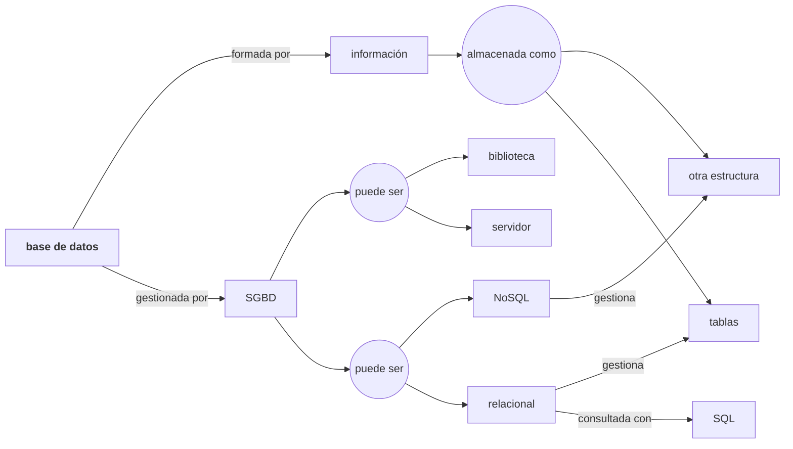

# Herramientas y primeras consultas de datos

---

## Objetivos

Contenidos basados en [The Querynomicon: An Introduction to SQL for Weary Data Scientist](https://gvwilson.github.io/sql-tutorial/), adaptados a la base de datos de la **plataforma de streaming musical** que usamos en clase.

Los objetivos de aprendizaje de la sesión son:

- Entender el concepto de sistema gestor de bases de datos relacional
- Entender arquitectura cliente-servidor vs proceso único (librería)
- Instalar y manejar herramientas de trabajo con base de datos
- Escribir consultas SQL para seleccionar, filtrar y ordenar datos
- Realizar operaciones aritméticas
- Buscar patrones en cadenas de texto

---
## Conceptos básicos

- Una **base de datos** es una colección de datos que se pueden buscar y recuperar
- Un **sistema gestor de bases de datos** (DBMS) es un programa que gestiona un tipo particular de base de datos
- Cada DBMS almacena los datos a su manera
    - SQLite almacena cada base de datos en un único archivo
    - PostgreSQL distribuye la información en muchos archivos para un mayor rendimiento
- Un DBMS puede ser una **biblioteca integrada** en otros programas (SQLite) o un **servidor** (PostgreSQL, Oracle)
- Un **sistema gestor de bases de datos relacionales** (RDBMS) almacena los datos en **tablas** y utiliza **SQL** para las consultas
- Desafortunadamente, cada RDBMS tiene su propio **dialecto de SQL**

---
### SQL

Lenguaje de Consultas Estándar (Standard Query Language, ISO/IEC 9075)

Uno de los principales lenguajes de programación y el primero en ofertas de trabajo, según el informe “[The Top Programming Languages](https://spectrum.ieee.org/top-programming-languages-2024)” publicado anualmente por IEEE Spectrum.

- Es un lenguaje **declarativo**, el usuario especifica qué quiere, pero no cómo conseguirlo. Los lenguajes de programación suelen ser procedimentales.
- Se diseñó para que se leyese como inglés normal y fuese **fácil de usar**.
- Es un lenguaje **unificado**. Usado por todo tipo de usuarios, desde el administrador hasta el usuario final.

Especifica varios **sublenguajes**, entre otros:

- **Lenguaje de Definición de Datos** (LDD) para crear, modificar y borrar objetos de la base de datos (create, alter y drop).
- **Lenguaje de Manipulación de Datos** (LMD) para consultar y manipular los datos (select, insert, update y delete). En esta lección, solo consultaremos datos con select.

---

### Cliente-servidor vs Biblioteca


---

### Grafo de resumen



---
### SQLite

SQLite ([https://sqlite.org](https://sqlite.org)), diseñado por Richard Hipp, se lanzó por primera vez en el **2000**.

A diferencia de MySQL y PostgreSQL, SQLite **no es un sistema cliente-servidor** en el que el servidor se ejecuta como un proceso independiente.

SQLite es una **biblioteca de funciones en lenguaje C** que se pueden llamar directamente desde el código de la aplicación y **ejecutar en el proceso de la aplicación**.

SQLite afirma ser el **sistema de base de datos más desplegado del mundo.** Está integrado (de manera invisible) en todos los teléfonos inteligentes Apple o Android; todos los ordenadores Mac o Windows; todos los navegadores Firefox, Chrome o Safari; y en innumerables aplicaciones conocidas.

Por diseñar SQLite, Richard Hipp recibió el premio **SIGMOD Systems Award en 2017**.

---
## Herramientas

Para empezar necesitamos unas herramientas básicas:

- Un sistema gestor de bases de datos (SGBD): [SQLite](https://www.sqlite.org/download.html) (sqlite-tools-XXX.zip)
- Una herramienta de trabajo con bases de datos:
	- CLI: sqlite3 + vim (o cualquier editor de textos) -> [principio KISS](https://en.wikipedia.org/wiki/KISS_principle)
	- Interfaz de usuario gráfica: [DBeaver](https://dbeaver.io/) o [Jetbrains Datagrip](https://www.jetbrains.com/datagrip/download/?section=windows)
- Una base de datos de ejemplo:
    - Descargar el script SQL `streaming_lab.sql` desde [SQL snippets](https://i3lab.unex.es/sql-snippets/index.html?db=streaming):
        - Ejecutar script mediante herramienta de trabajo con bases de datos
    - Es una **versión reducida** de la base de datos de la plataforma de streaming que seguimos en clase. Contiene cuatro tablas:
	    - `cancion` contiene la información de 74 canciones de la plataforma
	    - `cancion_muestra` es un subconjunto de 10 canciones utilizado en las primeras consultas para mantener la legibilidad de la salida
	    - `artista` e `interpreta` guardan quién interpreta cada canción. **En estas dos sesiones no las usaremos**: para saber quién canta una canción hay que *reunir* dos tablas, y eso lo aprenderemos más adelante (JOIN)

>[!info]  SQL snippets: herramienta para las lecciones
>Como alternativa más sencilla, podemos usar **[SQL snippets](https://i3lab.unex.es/sql-snippets/index.html?db=streaming)**. - pequeña aplicación web para la asignatura que contiene: el gestor (sqlite), un cliente web muy sencillo y todas las de bases de datos. Es la herramienta que usaremos siempre para los ejercicios. En caso de que el servidor de la UEx no esté operativo, podemos usar la [versión publicada en GitHub pages de SQL snippets](https://rre-uex.github.io/sql-snippets/).

---
### Tabla cancion

Estas son las 10 canciones de `cancion_muestra` (la tabla `cancion` tiene las mismas columnas y 74 filas):

| id_cancion | titulo                | genero | pais           | idioma | duracion | anio | reproducciones | me_gusta  | valoracion |
| ---------- | --------------------- | ------ | -------------- | ------ | -------- | ---- | -------------- | --------- | ---------- |
| 1          | Bohemian Rhapsody     | Rock   | Reino Unido    | EN     | 354      | 1975 | 2154000000     | 73517784  | 3.8        |
| 4          | Blinding Lights       | Pop    | Estados Unidos | EN     | 200      | 2019 | 4312000000     | 198300375 | 4.4        |
| 5          | Love Story            | Pop    | Estados Unidos | EN     | 235      | 2008 | 201611000      | 7761838   | 3.1        |
| 7          | You're My Best Friend | Rock   | Reino Unido    | EN     | 172      | 1975 | 50408000       | 693528    | 4.5        |
| 14         | Wonderwall            | Rock   | Reino Unido    | EN     | 258      | 1995 | 2010000000     | 18665751  | 4.3        |
| 26         | Entre dos tierras     | Rock   | España         | ES     | 369      | 1990 | 25164000       | 933820    | 4.2        |
| 32         | Rolling in the Deep   | Pop    | Reino Unido    | EN     | 228      | 2010 | 1395000        | 46383     | 3.8        |
| 49         | Malamente             | Pop    | España         | ES     | 148      | 2018 | 235000         | 10049     | 4.8        |
| 56         | Lose Yourself         | Rap    | Estados Unidos | EN     | 326      | 2002 | 2205000000     | 31556610  | 4.9        |
| 69         | Quédate               | Rap    | España         | ES     | 204      | 2022 | 1105000000     | 35714063  | 3.3        |

Explicación del significado de las columnas
- `id_cancion`: identificador de la canción en la plataforma
- `titulo`: título de la canción
- `genero`: género musical (Rock, Pop o Rap)
- `pais`: país en el que se publicó la canción (Reino Unido, Estados Unidos o España)
- `idioma`: idioma de la letra, en código de dos letras (EN, ES). Si no se ha registrado, no tiene valor
- `duracion`: duración en segundos
- `anio`: año de publicación
- `reproducciones`: número total de reproducciones en la plataforma
- `me_gusta`: número de "me gusta" que ha recibido
- `valoracion`: valoración media de los usuarios, de 1.0 a 5.0

>[!warning] Datos ficticios
>Las canciones son reales, pero las reproducciones, los "me gusta" y las valoraciones se han generado para la asignatura. Hay fichas incompletas a propósito (canciones sin idioma, sin año o sin ninguna cifra), igual que ocurre en cualquier base de datos real.

---

## La cláusula SELECT

---

### Seleccionar una constante

Código SQL:
```sql
select 1;
```
Salida:
```
1
```

- `select` es una **palabra clave de SQL**
- Normalmente se utiliza para **seleccionar datos de una tabla**…
- …pero si lo único que queremos es un valor constante, no necesitamos especificar una tabla
- Se requiere terminar la sentencia con un **punto y coma**

---
### Seleccionar todos los valores de una tabla

Código SQL:
```sql
select *
from cancion_muestra;
```
Salida:

| id_cancion | titulo                | genero | pais           | idioma | duracion | anio | reproducciones | me_gusta  | valoracion |
| ---------- | --------------------- | ------ | -------------- | ------ | -------- | ---- | -------------- | --------- | ---------- |
| 1          | Bohemian Rhapsody     | Rock   | Reino Unido    | EN     | 354      | 1975 | 2154000000     | 73517784  | 3.8        |
| 4          | Blinding Lights       | Pop    | Estados Unidos | EN     | 200      | 2019 | 4312000000     | 198300375 | 4.4        |
| 5          | Love Story            | Pop    | Estados Unidos | EN     | 235      | 2008 | 201611000      | 7761838   | 3.1        |
| 7          | You're My Best Friend | Rock   | Reino Unido    | EN     | 172      | 1975 | 50408000       | 693528    | 4.5        |
| 14         | Wonderwall            | Rock   | Reino Unido    | EN     | 258      | 1995 | 2010000000     | 18665751  | 4.3        |
| 26         | Entre dos tierras     | Rock   | España         | ES     | 369      | 1990 | 25164000       | 933820    | 4.2        |
| 32         | Rolling in the Deep   | Pop    | Reino Unido    | EN     | 228      | 2010 | 1395000        | 46383     | 3.8        |
| 49         | Malamente             | Pop    | España         | ES     | 148      | 2018 | 235000         | 10049     | 4.8        |
| 56         | Lose Yourself         | Rap    | Estados Unidos | EN     | 326      | 2002 | 2205000000     | 31556610  | 4.9        |
| 69         | Quédate               | Rap    | España         | ES     | 204      | 2022 | 1105000000     | 35714063  | 3.3        |

- Ésta sí es una consulta de verdad
- Usa * para indicar “todas las columnas”
- Usa `from nombretabla` para especificar la tabla
- El **resultado** de una sentencia `SELECT` siempre es una **tabla**.

---

### Especificar columnas

Código SQL:
```sql
select
    titulo,
    genero,
    pais
from cancion_muestra;
```
Salida:

| titulo                | genero | pais           |
| --------------------- | ------ | -------------- |
| Bohemian Rhapsody     | Rock   | Reino Unido    |
| Blinding Lights       | Pop    | Estados Unidos |
| Love Story            | Pop    | Estados Unidos |
| You're My Best Friend | Rock   | Reino Unido    |
| Wonderwall            | Rock   | Reino Unido    |
| Entre dos tierras     | Rock   | España         |
| Rolling in the Deep   | Pop    | Reino Unido    |
| Malamente             | Pop    | España         |
| Lose Yourself         | Rap    | Estados Unidos |
| Quédate               | Rap    | España         |

- Especifica los nombres de las columnas separados por comas
    - En cualquier orden
    - Se permiten duplicados
- Se recomienda usar saltos de línea para facilitar la lectura

---

### Ordenar los resultados

Código SQL:
```sql
select
    titulo,
    idioma,
    pais
from cancion_muestra
order by pais asc, idioma desc;
```
Salida:

| titulo                | idioma | pais           |
| --------------------- | ------ | -------------- |
| Entre dos tierras     | ES     | España         |
| Malamente             | ES     | España         |
| Quédate               | ES     | España         |
| Blinding Lights       | EN     | Estados Unidos |
| Love Story            | EN     | Estados Unidos |
| Lose Yourself         | EN     | Estados Unidos |
| Bohemian Rhapsody     | EN     | Reino Unido    |
| You're My Best Friend | EN     | Reino Unido    |
| Wonderwall            | EN     | Reino Unido    |
| Rolling in the Deep   | EN     | Reino Unido    |

- `order by` debe seguir a `from` (que debe seguir a `select`)
- `asc` es ascendente, `desc` es descendente
- El valor predeterminado es ascendente, pero es mejor especificarlo

---

### Ejercicio 1 - ORDER BY

Escribe una consulta SQL para seleccionar las columnas título (`titulo`) y reproducciones (`reproducciones`) de `cancion_muestra` en ese orden, ordenadas de modo que la canción más reproducida aparezca primero.

Solución:
```sql
select titulo, reproducciones 
from cancion_muestra 
order by reproducciones desc;
```

| titulo                | reproducciones |
| --------------------- | -------------- |
| Blinding Lights       | 4312000000     |
| Lose Yourself         | 2205000000     |
| Bohemian Rhapsody     | 2154000000     |
| Wonderwall            | 2010000000     |
| Quédate               | 1105000000     |
| Love Story            | 201611000      |
| You're My Best Friend | 50408000       |
| Entre dos tierras     | 25164000       |
| Rolling in the Deep   | 1395000        |
| Malamente             | 235000         |

---

## Filtrando filas en el resultado

---

### Limitar número de filas del resultado


Código SQL:
```sql
-- La tabla cancion tiene 74 filas
select
    titulo,
    genero,
    idioma,
    pais
from cancion
order by genero asc, idioma asc, pais asc, titulo asc
limit 10;
```
Salida:

| titulo             | genero | idioma | pais           |
| ------------------ | ------ | ------ | -------------- |
| Pista sin título 2 | Pop    |        | Estados Unidos |
| Love Story         | Pop    |        | Reino Unido    |
| Rehab              | Pop    |        | Reino Unido    |
| 7 rings            | Pop    | EN     | Estados Unidos |
| Anti-Hero          | Pop    | EN     | Estados Unidos |
| Billie Jean        | Pop    | EN     | Estados Unidos |
| Blinding Lights    | Pop    | EN     | Estados Unidos |
| Like a Prayer      | Pop    | EN     | Estados Unidos |
| Love Story         | Pop    | EN     | Estados Unidos |
| Save Your Tears    | Pop    | EN     | Estados Unidos |

- Los **comentarios** comienzan con -- y continúan hasta el final de la línea
	- La tabla cancion contiene 74 filas
- `limit N` especifica el número máximo de filas devueltas por la consulta
- `limit` no pertenece al estándar SQL y en otros SGBD aparece de otra forma
- Fíjate en las primeras filas: el idioma aparece **vacío**. Son canciones cuyo idioma no se ha registrado. Hablaremos de esto en la próxima sesión

---

### Offset en las filas del resultado

Código SQL:
```sql
select
    titulo,
    genero,
    idioma,
    pais
from cancion
order by genero asc, idioma asc, pais asc, titulo asc
limit 10 offset 3;
```
Salida:

| titulo          | genero | idioma | pais           |
| --------------- | ------ | ------ | -------------- |
| 7 rings         | Pop    | EN     | Estados Unidos |
| Anti-Hero       | Pop    | EN     | Estados Unidos |
| Billie Jean     | Pop    | EN     | Estados Unidos |
| Blinding Lights | Pop    | EN     | Estados Unidos |
| Like a Prayer   | Pop    | EN     | Estados Unidos |
| Love Story      | Pop    | EN     | Estados Unidos |
| Save Your Tears | Pop    | EN     | Estados Unidos |
| Shake It Off    | Pop    | EN     | Estados Unidos |
| Starboy         | Pop    | EN     | Estados Unidos |
| Thriller        | Pop    | EN     | Estados Unidos |

- `offset N` debe seguir a `limit`
- Especifica la cantidad de filas que se omitirán desde el inicio de la selección
- Por lo tanto, esta consulta omite las primeras 3 y muestra las siguientes 10
- `offset` no pertenece al estándar SQL y en otros SGBD aparece de otra forma

---

### Eliminar duplicados

Código SQL:
```sql
select distinct
    genero,
    idioma,
    pais
from cancion;
```
Salida:

| genero | idioma | pais           |
| ------ | ------ | -------------- |
| Rock   | EN     | Reino Unido    |
| Pop    | EN     | Estados Unidos |
| Pop    |        | Reino Unido    |
| Rock   |        | Reino Unido    |
| Rock   | EN     | Estados Unidos |
| Rock   |        | Estados Unidos |
| Rock   | ES     | España         |
| Rock   |        | España         |
| Rock   | EN     | España         |
| Pop    | EN     | Reino Unido    |
| Pop    | ES     | Estados Unidos |
| Pop    | ES     | España         |
| Rap    | EN     | Estados Unidos |
| Rap    |        | Estados Unidos |
| Rap    | ES     | Estados Unidos |
| Rap    | EN     | Reino Unido    |
| Rap    | ES     | España         |
| Rap    |        | España         |
| Pop    |        | Estados Unidos |

- El **resultado** de una selección puede contener **filas duplicadas**
	- SQL usa el concepto de multiconjuntos o bolsas (multi-sets o bags): permiten elementos duplicados
	- Si no queremos duplicados en el resultado, hay que indicarlo explícitamente
- La palabra clave `distinct` debe aparecer justo después de `select`
    - Se supone que SQL se lee como el inglés
    - Lenguaje declarativo

---

### Ejercicio 2 - DISTINCT

Escribe una consulta para seleccionar las distintas combinaciones de país (`pais`) y género (`genero`) de la tabla `cancion`.

Solución:
```sql
select distinct pais, genero
from cancion;
```

| pais           | genero |
| -------------- | ------ |
| Reino Unido    | Rock   |
| Estados Unidos | Pop    |
| Reino Unido    | Pop    |
| Estados Unidos | Rock   |
| España         | Rock   |
| España         | Pop    |
| Estados Unidos | Rap    |
| Reino Unido    | Rap    |
| España         | Rap    |

---

### Filtrar resultados con `where`

Código SQL:
```sql
select distinct
    genero,
    idioma,
    pais
from cancion
where pais = 'Estados Unidos';
```
Salida:

| genero | idioma | pais           |
| ------ | ------ | -------------- |
| Pop    | EN     | Estados Unidos |
| Rock   | EN     | Estados Unidos |
| Rock   |        | Estados Unidos |
| Pop    | ES     | Estados Unidos |
| Rap    | EN     | Estados Unidos |
| Rap    |        | Estados Unidos |
| Rap    | ES     | Estados Unidos |
| Pop    |        | Estados Unidos |

- La cláusula `where condition` filtra las filas devueltas por la selección
- La **condición se evalúa de forma independiente para cada fila**
- Solo las filas que satisfacen la condición aparecen en los resultados
- Usa comillas simples para `‘datos de texto’` y comillas dobles para `"nombres de columna extraños"`
	- SQLite aceptará datos de texto entre comillas dobles, pero [SQLFluff](https://sqlfluff.com/) se quejará

---

### Ejercicio 3 - WHERE

Escribe una consulta para seleccionar las reproducciones (`reproducciones`) de las canciones (`cancion`) que tengan menos de un millón de reproducciones.

Solución:
```sql
select reproducciones
from cancion
where reproducciones < 1000000;
```

| reproducciones |
| -------------- |
| 369000         |
| 100000         |
| 232000         |
| 392000         |
| 235000         |
| 734000         |
| 158000         |
| 222000         |
| 0              |

---

### Ejercicio 4 - WHERE

Escribe otra consulta para seleccionar el género (`genero`) y el idioma (`idioma`) de las canciones (`cancion`) que tengan menos de un millón de reproducciones. Esto demuestra que las columnas mostradas y las utilizadas en el filtrado son independientes entre sí.

Solución:
```sql
select distinct genero, idioma
from cancion
where reproducciones < 1000000;
```

| genero | idioma |
| ------ | ------ |
| Rock   | EN     |
| Pop    | EN     |
| Pop    | ES     |
| Rap    | EN     |
| Rap    | ES     |
| Rock   | ES     |

---

### Múltiples condiciones de filtrado

Código SQL:
```sql
select distinct
    genero,
    idioma,
    pais
from cancion
where pais = 'Estados Unidos' and idioma != 'EN';
```
Salida:

| genero | idioma | pais           |
| ------ | ------ | -------------- |
| Pop    | ES     | Estados Unidos |
| Rap    | ES     | Estados Unidos |

- Operadores para las condiciones:
	- and: ambas subcondiciones deben ser verdaderas
	- or: una o ambas partes deben ser verdaderas
- Observa que las filas de canciones de Estados Unidos con idioma desconocido (vacío) no pasaron el filtro, aunque "vacío" no es 'EN'
    - Hablaremos de esto más adelante

---

### Operadores de comparación

| Operador | Descripción         |
| -------- | ------------------- |
| =        | Igual a             |
| >        | Mayor que           |
| <        | Menor que           |
| >=       | Mayor que o igual a |
| <=       | Menor que o igual a |
| <>       | No igual a          |
| !=       | No igual a          |

---

### Operadores booleanos

| Operador | Descripción                                                     |
| -------- | --------------------------------------------------------------- |
| AND      | Se evalúa a verdadero si ambas condiciones son verdaderas       |
| OR       | Se evalúa a verdadero si alguna de las condiciones es verdadera |
| NOT      | Cambia el resultado de la condición                             |

---

### Ejercicio 5 - WHERE operadores

Utiliza el operador not para seleccionar las canciones (solo las columnas `titulo`, `genero`, `pais`) que no sean de Rap.

Solución:
```sql
select distinct titulo, genero, pais
from cancion
where genero != 'Rap';
```

| titulo                     | genero | pais           |
| -------------------------- | ------ | -------------- |
| Bohemian Rhapsody          | Rock   | Reino Unido    |
| Somebody to Love           | Rock   | Reino Unido    |
| Under Pressure             | Rock   | Reino Unido    |
| Blinding Lights            | Pop    | Estados Unidos |
| Love Story                 | Pop    | Estados Unidos |
| Love Story                 | Pop    | Reino Unido    |
| You're My Best Friend      | Rock   | Reino Unido    |
| Don't Stop Me Now          | Rock   | Reino Unido    |
| We Will Rock You           | Rock   | Reino Unido    |
| Another One Bites the Dust | Rock   | Reino Unido    |
| Heroes                     | Rock   | Reino Unido    |
| Space Oddity               | Rock   | Reino Unido    |
| Let's Dance                | Rock   | Reino Unido    |
| Wonderwall                 | Rock   | Reino Unido    |
| Don't Look Back in Anger   | Rock   | Reino Unido    |
| Creep                      | Rock   | Reino Unido    |
| Do I Wanna Know?           | Rock   | Reino Unido    |
| 505                        | Rock   | Reino Unido    |
| Hey Jude                   | Rock   | Reino Unido    |
| Let It Be                  | Rock   | Reino Unido    |
| Yellow                     | Rock   | Reino Unido    |
| Smells Like Teen Spirit    | Rock   | Estados Unidos |
| Sweet Child O' Mine        | Rock   | Estados Unidos |
| Everlong                   | Rock   | Estados Unidos |
| Hotel California           | Rock   | Estados Unidos |

*(se muestran las 25 primeras filas de un total de 58)*

---

### Ejercicio 6 - WHERE operador OR exclusivo

El operador `OR` de SQL es un operador ‘o inclusivo’: se ejecuta correctamente si una o ambas condiciones son verdaderas. SQL no proporciona un operador específico para el operador ‘o exclusivo’, que es verdadero si solo una de las condiciones es verdadera, pero se puede lograr el mismo efecto utilizando `AND`, `OR` y `NOT`. Escribe una consulta para seleccionar las canciones (`cancion`) que estén en español (`idioma` = 'ES') o que se hayan publicado en España (`pais`), pero no ambas cosas.

Solución:
```sql
select distinct titulo, idioma, pais
from cancion
where (idioma = 'ES' and pais != 'España') or (idioma != 'ES' and pais = 'España'); 
```

| titulo           | idioma | pais           |
| ---------------- | ------ | -------------- |
| Devil Came to Me | EN     | España         |
| Garden           | EN     | España         |
| Baila Conmigo    | ES     | Estados Unidos |
| Tití Me Preguntó | ES     | Estados Unidos |
| Me Porto Bonito  | ES     | Estados Unidos |

- Observa el resultado: canciones en español publicadas fuera de España y canciones publicadas en España cantadas en inglés. La lógica booleana permite expresar preguntas bastante precisas.

---

## Operaciones con columnas

Veamos ahora operaciones con columnas comunes:

- Operaciones aritméticas
- Renombrado
- Operaciones de texto

---

### Operaciones aritméticas

Código SQL:
```sql
select
    duracion / 60.0,
    reproducciones / 1000000.0
from cancion
limit 3;
```
Salida:

| duracion / 60.0   | reproducciones / 1000000.0 |
| ----------------- | -------------------------- |
| 5.9               | 2154.0                     |
| 4.933333333333334 | 608.139                    |
| 4.133333333333334 | 44.11                      |

- Se pueden realizar los tipos habituales de operaciones aritméticas con valores individuales
- El cálculo se realiza para cada fila de forma independiente
- El nombre de la columna muestra el cálculo

>[!warning] División entera
>`duracion` y `reproducciones` son columnas de tipo entero. Si dividimos un entero entre otro entero (`duracion / 60`), SQLite (y también PostgreSQL) hace una **división entera** y descarta los decimales: 354 / 60 da 5, no 5.9. Por eso escribimos `60.0`: basta con que uno de los dos operandos sea decimal para que la división sea decimal. Compruébalo cambiando `60.0` por `60`.

---

### Operadores aritméticos

| Operador | Descripción    |
| -------- | -------------- |
| +        | Suma           |
| -        | Resta          |
| *        | Multiplicación |
| /        | División       |
| %        | Módulo         |

---

### Funciones matemáticas

| Función    | Descripción                                                |
| ---------- | ---------------------------------------------------------- |
| Round(X)   | Redondea el número X su entero más cercano                 |
| Round(X,Y) | Redondea el número X a Y decimales                         |
| Ceil(X)  | Redondea el número hacia el entero inmediatamente superior |
| Floor(X) | Redondea el número hacia el entero inmediatamente inferior |
| Abs(X)     | Valor absoluto de X                                        |
| Sqrt(X)    | Raíz cuadrada de X                                         |

---

### Renombrar columnas

Código SQL:
```sql
select
    duracion / 60.0 as minutos,
    reproducciones / 1000000.0 as millones_reproducciones,
    pais as donde_publicada
from cancion
limit 3;
```
Salida:

| minutos           | millones_reproducciones | donde_publicada |
| ----------------- | ----------------------- | --------------- |
| 5.9               | 2154.0                  | Reino Unido     |
| 4.933333333333334 | 608.139                 | Reino Unido     |
| 4.133333333333334 | 44.11                   | Reino Unido     |

- Usa `expression as name` para cambiar el nombre de la columna resultado
- Usa un nombre significativo al resultado del cálculo
- También se puede cambiar el nombre de las columnas sin modificar: alias

---

### Ejercicio 7 - Operaciones aritméticas

Escribe una consulta que calcule y devuelva una columna llamada `porcentaje_me_gusta` con el porcentaje de reproducciones que han acabado en un "me gusta" (es decir, `me_gusta` entre `reproducciones`, multiplicado por 100). Redondea el resultado para mostrar números con un solo decimal. Muestra solo las 10 primeras filas.

Solución:
```sql
select distinct
	round(me_gusta * 100.0 / reproducciones, 1) as porcentaje_me_gusta
from cancion
limit 10;
```

| porcentaje_me_gusta |
| ------------------- |
| 3.4                 |
| 1.3                 |
| 3.7                 |
| 4.6                 |
| 3.8                 |
|                     |
| 1.4                 |
| 5.0                 |
| 1.9                 |
| 5.6                 |

- Fíjate en la sexta fila: está vacía. Es la canción que no tiene ni reproducciones ni "me gusta" registrados. Lo veremos en la siguiente sesión.

---

### Patrones de texto

Código SQL:
```sql
select
    titulo,
    pais,
    genero
from cancion
where titulo LIKE '%love%' AND genero LIKE 'P__';
```
Salida:

| titulo     | pais           | genero |
| ---------- | -------------- | ------ |
| Love Story | Estados Unidos | Pop    |
| Love Story | Reino Unido    | Pop    |

- Usa el operador `LIKE` para buscar patrones en cadenas de texto
- Caracteres especiales para definir patrones:
	- _ reemplaza a cualquier carácter
	- % reemplaza a cualquier número de caracteres (incluido 0 caracteres)
- En SQLite, `LIKE` **no distingue mayúsculas de minúsculas** para las letras del alfabeto inglés: `'%love%'` encuentra "Love Story". En otros SGBD (PostgreSQL) sí distingue, y hay que usar `ILIKE` o pasar todo a minúsculas con `lower()`.

---

### Funciones de texto

| Función         | Descripción                                                  |
| --------------- | ------------------------------------------------------------ |
| \|\|            | Operador de concatenación                                    |
| Length(X)       | Longitud de la cadena de texto X                             |
| Lower(X)        | Pasa a minúsculas todos las letras                           |
| Upper(X)        | Pasa a mayúsculas todos las letras                           |
| Initcap(X)      | Pasa todas las letras a minúscula y las primeras a mayúscula |
| substring(X, N) | Devuelve la subcadena de X a partir del caracter N           |
| Replace(X,Y,Z)  | Reemplaza la subcadena Y dentro de X por Z                   |
|                 |                                                              |

---

### Ejercicio 8 - Operador concatenación

Escribe una consulta que calcule y devuelva una columna llamada `que_donde` que tenga el género (`genero`) y el país (`pais`) de cada canción separados por un solo espacio, sin repeticiones.

Solución:
```sql
select distinct
	genero || ' ' || pais as que_donde
from cancion;
```

| que_donde           |
| ------------------- |
| Rock Reino Unido    |
| Pop Estados Unidos  |
| Pop Reino Unido     |
| Rock Estados Unidos |
| Rock España         |
| Pop España          |
| Rap Estados Unidos  |
| Rap Reino Unido     |
| Rap España          |

---

## Fin de la lección

Enhorabuena, has llegado al final de la sesión. 

Enhorabuena, has llegado al final de la sesión. 


Fuente: [Diego's Tumblr](https://temblorxd.tumblr.com/)

---
