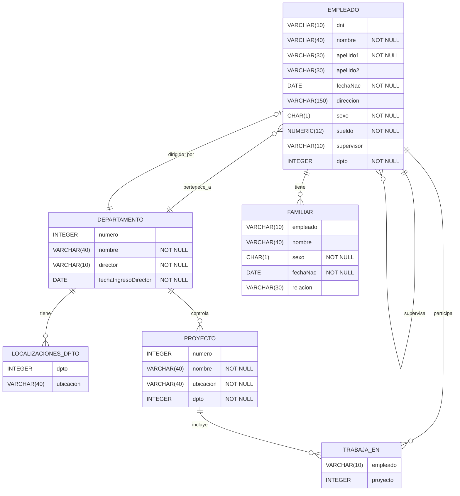

# Modelo Relacional

---
tags: database, lecture, relational-model
author: rre
origin: BD2425/teoria/Chapter05-es.pptx
date: 2025-09-01

---
# Origen

- Propuesto por el Dr. [E.F. Codd](https://en.wikipedia.org/wiki/Edgar_F._Codd) de IBM Research en 1970 en el artículo:

>[!INFO] Artículo
> E. F. Codd. 1970. *[A Relational Model for Large Shared Data Banks](https://doi.org/10.1145/362384.362685)*, Commun. ACM 13, 6 (June 1970), 377–387. 

- El artículo anterior provocó una **gran revolución en el campo de la gestión de bases de datos** y le llevó al Dr. Codd a ganar el codiciado [Premio ACM Turing](https://amturing.acm.org/).

---
# 1. Estructuras del modelo relacional

- El Modelo relacional es un modelo de datos que se basa en el **concepto de Relación de conjuntos**
	- La fuerza del enfoque relacional para la gestión de datos proviene de la base formal proporcionada por la **teoría de conjuntos**
	- Revisamos los elementos esenciales del modelo relacional formal
- En la práctica , existe un **modelo práctico** estándar basado en **SQL**

> [!info] Aviso
> Existen varias diferencias importantes entre el modelo formal y el modelo práctico (implementado por los SGBDR)

## 1.1. Relación como Producto Cartesiano

En teoría de conjuntos, una **relación** es un subconjunto del producto cartesiano de uno o más conjuntos (dominios). 

>[!info] Relación
>Una relación de un conjunto $A$ a un conjunto $B$ es un subconjunto $A \times B$. Por lo tanto, una relación $R$ consiste en pares ordenados $(a,b)$, donde $a \in A$ y $b \in B$. Si $(a,b) \in R$, decimos que *están relacionados*, y también se escribe $a R b$.

De forma general, si tenemos $n$ dominios $D_1, D_2, \dots, D_n$, entonces:

$$R \subseteq D_1 \times D_2 \times \dots \times D_n $$

Cada elemento de la relación R es una **tupla** $(d_1, d_2, \dots, d_n)$ donde $d_i \in D_i$.

### Ejemplo Ilustrativo: Relación ESTUDIANTE

Imaginemos una relación para almacenar información de estudiantes con tres atributos:

**Dominios:**

- $D_1$ = {nombres válidos} = {"Ana", "Carlos", "María", "Pedro", ...}
- $D_2$ = {edades válidas} = {18, 19, 20, 21, 22, ...}
- $D_3$ = {carreras} = {"Informática", "Matemáticas", "Física", ...}

**Producto cartesiano $D_1 \times D_2 \times D_3$** incluiría todas las combinaciones posibles:

- ("Ana", 18, "Informática")
- ("Ana", 18, "Matemáticas")
- ("Ana", 19, "Informática")
- ("Carlos", 20, "Física")
- ... (millones de combinaciones)

**La relación ESTUDIANTE** es un subconjunto específico que contiene solo las tuplas que representan estudiantes reales:

```
ESTUDIANTE = {
  ("Ana", 20, "Informática"),
  ("Carlos", 19, "Matemáticas"),
  ("María", 21, "Informática"),
  ("Pedro", 22, "Física")
}
```

### Conceptos Clave

- **Grado**: número de dominios (en el ejemplo, grado 3)
- **Cardinalidad**: número de tuplas en la relación (en el ejemplo, 4)
- **Esquema**: estructura de la relación con nombres de atributos
- **Instancia**: conjunto actual de tuplas

Esta formalización matemática es lo que hace que el modelo relacional sea tan sólido y permita operaciones algebraicas precisas como las del álgebra relacional.

>[!tip] Notación matemática en ficheros markdown
> Los editores de makrdown pueden usar diferentes bibliotecas para procesar notación matemática y producir una visualización correcta de expresiones matemáticas.
> Una opción común es usar [MathJax](https://www.mathjax.org/), que es una biblioteca de JavaScript multinavegador que muestra notación matemática en navegadores web, utilizando marcado MathML, LaTeX y ASCIIMathML.
> Consulta esta referencia rápida [MathJax quick reference](https://math.meta.stackexchange.com/questions/5020/mathjax-basic-tutorial-and-quick-reference) si quieres escribir expresiones matemáticas en documentos markdown.


---
## 1.2. Estructuras 

### Definiciones informales

- Informalmente, una **relación** parece una **tabla** de valores. 
- Una relación normalmente contiene un **conjunto de filas.**
- Los datos de cada **fila** representan hechos que corresponden a una **entidad del mundo real o a una relación entre entidades**
	- En el modelo formal, las filas se llaman **tuplas**.
- Cada **columna** tiene un **encabezado** que indica el **significado** de los datos en esa columna.
	- En el modelo formal, el encabezado de la columna se denomina **atributo**.

>[!info] No siempre tablas físicamente.
> Cabe destacar que esta implementación física es solo una de las posibles maneras de implementar la tabla en estructuras de datos físicas. De hecho, no es la forma habitual de representar relaciones, y gran parte del estudio de los sistemas de bases de datos se centra en las formas correctas de implementar dichas tablas. Gran parte de la distinción reside en la escala de las relaciones: normalmente no se implementan como estructuras de memoria principal, y su correcta implementación física debe tener en cuenta la necesidad de acceder a relaciones de gran tamaño que residen en el disco.

### Definiciones informales vs formales

| Informal         | Formal           |
| ---------------- | ---------------- |
| Tabla            | Relación         |
| Nombre columna   | Atributo         |
| Tipo columna     | Dominio          |
| Fila             | Tupla            |
| Definición tabla | Esquema relación |
| Datos tabla      | Estado relación  |

### Esquema de una relación

- El **esquema** (o descripción) de una relación:
	- Denotado por $R(A_1, A_2, \dots, A_n)$
	- $R$ es el **nombre** de la relación.
	- Los **atributos** de la relación son $A_1, A_2, \dots, A_n$

- Ejemplo: $CLIENTE (id, nombre, dirección, teléfono)$
	- $CLIENTE$ es el nombre de la relación
	- Definida sobre los cuatro atributos: $id, nombre, dirección, teléfono$
- Cada atributo tiene un **dominio** (conjunto de valores válidos).
	- P. ej., el dominio del atributo $id$ podría ser números de 6 dígitos
### Tupla

- Una tupla es un **conjunto ordenado de valores** (entre paréntesis )
- Una tupla tiene un componente para cada uno de los atributos de la relación.
- Cada valor se deriva de un **dominio** apropiado
- Una fila en la relación CLIENTE es una **tupla de grado 4** (tiene cuatro valores), por ejemplo:
	- (632895, 'John Smith', '101 Main St. Atlanta, GA 30332', '(404) 894-2000')

>[!NOTE] Concepto de relación
>Una **relación** es un **conjunto de tuplas** (filas). Por definición, todos los elementos de un conjunto son distintos; por lo tanto, **todas las tuplas de una relación deben ser también distintas**. En conclusión, dos tuplas no pueden tener la misma combinación de valores para todos sus atributos.
### Dominio

- Un **dominio** tiene:
	- una **definición lógica**:  “USA_phone_numbers” son el conjunto de números de teléfono de 10 dígitos válidos en EE. UU.

	- un **tipo de datos o un formato** definido para él
		- Tipo de datos: número, cadena de texto, fecha, etc.
		- Las fechas tienen varios formatos, como año, mes, fecha con formato aaaa-mm-dd o dd mm, aaaa, etc.

- El **nombre del atributo** designa el **papel** que desempeña un dominio en una **relación**:
	- Se utiliza para interpretar el significado de los elementos de datos correspondientes a ese atributo.
	- Ejemplo: el dominio Fecha se puede utilizar para definir dos atributos denominados  *Fecha-factura* y  *Fecha-pago* con diferentes significados.
### Estado (o instancia) de una relación

- El estado de una relación es un **subconjunto del producto cartesiano de los dominios de sus atributos**.
	- Cada dominio contiene el conjunto de todos los valores posibles que puede tomar el atributo

- Formalmente, dados
	- $R(A_1, A_2, \dots, A_n)$
	- $r(R) \subset dom(A_1) \times dom(A_2) \times \dots \times dom(A_n)$

- $R(A_1, A_2, \dots, A_n)$ es el esquema de la relación
	- $R$ es el nombre de la relación.
	- $A_1, A_2, \dots, A_n$ son los atributos de la relación
- $r(R)$: un estado específico (o "población") de la relación $R$: un conjunto de tuplas (filas)
	- $r(R) = {t_1, t_2, \dots, t_n}$ donde cada $t_i$ es una tupla de grado $n$
	- $t_i = (v_1, v_2, \dots, v_n)$ donde cada elemento $v_j$  es del dominio $A_j$

#### Ejemplo de estado de una relación

- Sea $R(A_1, A_2)$ un esquema de relación:
	- Sea $dom(A_1) = {0,1}$
	- Sea $dom(A_2) = {a,b,c}$

- Entonces: $dom(A_1) \times dom(A_2)$ son todas las combinaciones posibles:
	{(0,a), (0,b), (0,c), (1,a), (1,b), (1,c)}

- El estado de relación es  $r(R) \subseteq dom(A_1) \times dom(A_2)$
- Por ejemplo: $r(R)$ podría ser {(0,a), (0,b), (1,c)}
	- este es un posible estado (o “población” o “extensión” ) r de la relación R, definida sobre $A_1$ y $A_2$.
	- tiene tres tuplas de grado 2: (0,a), (0,b), (1,c)

### Características de las relaciones

Ordenación de las tuplas en una relación r(R). Las tuplas **no se consideran ordenadas**, aunque parezcan estar en forma tabular.


Ordenación de atributos en un esquema de relación $R$ (y de valores dentro de cada tupla)
Los **atributos** en $R(A_1, A_2, \dots, A_n)$ y los **valores** en $t = (v_1, v_2, \dots, v_n)$ están **ordenados**.

Existe una alternativa más general de relación que no requiere este orden. Incluye tanto el nombre como el valor de cada uno de los atributos.
	- Ejemplo: t= ( {nombre, 'John' }, {dni, '123456789'} )
	- Esta representación puede denominarse “autodescriptiva”

Los valores en una tupla:
	- deben ser **atómicos** (indivisibles)
	- deben ser **del dominio del atributo**
	- pueden ser valores nulos. El valor **nulo (NULL)** representa valores desconocidos, no disponibles o inaplicables en determinadas tuplas. Por regla general, se deben evitar valores null tanto como sea posible en el diseño de bases de datos.

###  Resumen de notación
- Un esquema de una relación $R$ de grado n se denota como $R(A_1, A_2, \dots, A_n)$.
- Las letras en mayúscula $Q, R, S$ denotan nombres de relaciones.
- Las letras en minúscula $q, r, s$ denotan estados de relaciones.
- Las letras $t, u, v$ denotan tuplas.
- En general, el nombre del esquema de una relación, como $ESTUDIANTE$, también indica el conjunto actual de tuplas en la relación (su estado actual) mientras que ESTUDIANTE(nombre, dni, …) se refiere solo al esquema de la relación.
- Un atributo A puede calificarse con el nombre de la relación $R$ a la que pertenece mediante la notación de punto $R.A$; por ejemplo, ESTUDIANTE.nombre o ESTUDIANTE.edad. Esto se debe a que **el mismo nombre puede usarse para dos atributos en relaciones diferentes**. Sin embargo, todos los nombres de atributo en una relación particular deben ser distintos.
- Una n-tupla $t$ en una relación $r(R)$ se denota por $t = (v_1, v_2, \dots, v_n)$, donde $v_i$ es el valor correspondiente al atributo $A_i$. La siguiente notación se refiere a los valores de los componentes de las tuplas:
	- Tanto $t[A_i]$ como $t.A_i$ (y, en ocasiones, $t[i]$) se refieren al valor $v_i$ en $t$ para el atributo $A_i$. 
	- Tanto $t[A_u, A_w, \dots, A_z]$ como $t.(A_u, A_w, \dots, A_z)$, donde $A_u, A_w, \dots, A_z$ es una lista de atributos de $R$, hacen referencia a la subtupla de valores $(v_u, v_w, \dots, v_z)$ de $t$ correspondiente a los atributos especificados en la lista.
- Ejemplo de acceso a valores de los componentes de una tupla
- Dada la tupla:
	- t = (’Barbara Benson’, ‘123456789’, ‘(817)839-8461’, ‘7384 Fontana Lane’, NULL, 19, 3.25) 
- de la relación ESTUDIANTE; tenemos
- $t[nombre]$ = (‘Barbara Benson’), 
- y $t[dni, notaMedia, edad]$ = (‘123456789’, 3.25, 19)

>[!note] **Convención para Relaciones y Atributos**
> Generalmente, seguiremos la convención de que **los nombres de relación empiezan en mayúscula** y **los nombres de atributos empiezan en minúscula**. Sin embargo, cuando los nombres de atributos no importan, usaremos una sola letra en mayúscula tanto para relaciones como para atributos, e.g., $R (A ,B ,C )$ para una relación genérica con 3 atributos.

## 1.3. Bases de datos relacionales

### Esquema de bases de datos relacionales

- Esquema de base de datos relacionales:
	- Un **conjunto** $S$ **de esquemas de relación** que pertenecen a la misma base de datos.
	- $S$: nombre del esquema de la base de datos.
	- $S = {R_1, R_2, \dots, R_n}$ y un conjunto $RI$ de restricciones de integridad.
	- $R_1, R_2, \dots, R_n$ son los nombres de los esquemas de relación individuales dentro de la base de datos $S$

#### Ejemplo de esquema de base de datos de EMPRESA 

Este esquema de base de datos solo contiene el esquema de las relaciones pero no el conjunto de restricciones de integridad, que lo veremos posteriormente.

- $EMPLEADO$(nombre, apellido1, apellido2, dni, fechaNac, dirección, sexo, sueldo, supervisor, dpto )
	- Representa una entidad del mundo real
	- Atributos no triviales:
		- `{supervisor}` indica quién es el supervisor de un determinado empleado
		- `{dpto}` indica a qué departamento pertenece un empleado

- $DEPARTAMENTO$(nombre, numero, director, fechaIngresoDirector)
	- Representa una entidad del mundo real
	- Atributos no triviales:
		- `{numero}` código que identifica a cada departamento
		- `{director}` indica qué empleado ejerce de director		

- $LOCALIZACIONES\_DPTO$(dpto, ubicacion)
	- Representa una entidad del mundo real
	- Atributos no triviales: 
		- `{dpto}` indica el departamento al que pertenece la localización 
		
- $PROYECTO$(nombre, numero, ubicacion, dpto)
	- Representa una entidad del mundo real
	- Atributos no triviales:
		- `{numero}` código que identifica a cada proyecto
		- `{dpto}` indica el departamento al que pertenece el proyecto.

- $TRABAJA\_EN$(empleado, proyecto, horas)
	- Representa una **asociación entre entidades del mundo real**
	- Atributos no triviales:
		- `{empleado}` indica el empleado que trabaja en un proyecto
		- `{proyecto}` indica el proyecto en el que trabaja un empleado

- $FAMILIAR$(empleado, nombre, sexo, fechaNac, relación)
	- Representa una entidad del mundo real
	- Atributos no triviales: 
		- `{empleado}` indica el empleado del que es familiar

#### Diagrama de la base de datos



#### Creación de esquema de base de datos en SQL

Antes de poder definir nuestra base de datos relacional, necesitamos conocer qué tipos de datos proporciona el estándar SQL porque son básicos para la definición del dominio de los atributos de las relaciones que conforman la base de datos.

##### Tipos de Datos SQL Estándar
(generada con Claude Opus 4.1)

| Categoría                 | Tipo de Dato                          | Descripción                            | Soporte SQLite                     |
| ------------------------- | ------------------------------------- | -------------------------------------- | ---------------------------------- |
| **Numéricos Enteros**     | `SMALLINT`                            | Entero pequeño (típicamente 2 bytes)   | ✅ Sí (como INTEGER)               |
|                           | `INTEGER` / `INT`                     | Entero estándar (típicamente 4 bytes)  | ✅ Sí (tipo nativo)                |
|                           | `BIGINT`                              | Entero grande (típicamente 8 bytes)    | ✅ Sí (como INTEGER)               |
| **Numéricos Decimales**   | `DECIMAL(p,s)` / `NUMERIC(p,s)`       | Numérico exacto con precisión y escala | ⚠️ Parcial (almacenado como REAL)  |
|                           | `REAL`                                | Punto flotante de precisión simple     | ✅ Sí (tipo nativo)                |
|                           | `DOUBLE PRECISION` / `FLOAT`          | Punto flotante de doble precisión      | ✅ Sí (como REAL)                  |
| **Cadenas de Caracteres** | `CHARACTER(n)` / `CHAR(n)`            | Cadena de longitud fija                | ✅ Sí (como TEXT)                  |
|                           | `CHARACTER VARYING(n)` / `VARCHAR(n)` | Cadena de longitud variable            | ✅ Sí (como TEXT)                  |
|                           | `TEXT`                                | Cadena de longitud variable            | ✅ Sí (tipo nativo)                |
| **Fecha y Hora**          | `DATE`                                | Fecha (año, mes, día)                  | ❌ No (usar TEXT o INTEGER)        |
|                           | `TIME`                                | Hora del día                           | ❌ No (usar TEXT o INTEGER)        |
|                           | `TIMESTAMP`                           | Fecha y hora combinadas                | ❌ No (usar TEXT o INTEGER)        |
|                           | `INTERVAL`                            | Intervalo de tiempo                    | ❌ No                              |
| **Booleano**              | `BOOLEAN`                             | Valores verdadero/falso                | ❌ No (usar INTEGER 0/1)           |
| **Datos Binarios**        | `BINARY(n)`                           | Datos binarios de longitud fija        | ✅ Sí (como BLOB)                  |
|                           | `VARBINARY(n)`                        | Datos binarios de longitud variable    | ✅ Sí (como BLOB)                  |
|                           | `BLOB`                                | Objeto Binario Grande                  | ✅ Sí (tipo nativo)                |
| **Adicionales**           | `CLOB`                                | Objeto de Caracteres Grande            | ✅ Sí (como TEXT)                  |
|                           | `XML`                                 | Datos XML                              | ❌ No (usar TEXT)                  |
|                           | `JSON`                                | Datos JSON                             | ⚠️ Parcial (usar TEXT, JSON1 ext.) |
|                           | `ARRAY`                               | Tipo array                             | ❌ No                              |

**Leyenda:**

- ✅ **Sí**: Completamente soportado
- ⚠️ **Parcial**: Soportado con limitaciones o conversiones
- ❌ **No**: No soportado nativamente

##### Creación de las tablas

La creación de este esquema de bases de datos en un SBDR consiste en definir todas las relaciones como tablas en SQL (sublenguaje LDD).

```sql

-- EMPLEADO(nombre, apellido1, apellido2, dni, fechaNac, dirección, sexo, sueldo, superdni, numeroDpto )

CREATE TABLE EMPLEADO (	
	nombre VARCHAR(40) NOT NULL,
	apellido1 VARCHAR(30) NOT NULL,
	apellido2 VARCHAR(30),
	dni VARCHAR(10) NOT NULL,
	fechaNac DATE NOT NULL,
	direccion VARCHAR(150),
	sexo CHAR(1) NOT NULL,
	sueldo NUMERIC(12,2) NOT NULL,
	supervisor VARCHAR(10),
	dpto INTEGER NOT NULL
);

-- DEPARTAMENTO(nombre, numero, director, fechaIngresoDirector)

CREATE TABLE DEPARTAMENTO (
	nombre VARCHAR(40) NOT NULL,
	numero INTEGER NOT NULL,
	director VARCHAR(10),
	PRIMARY KEY (numero)
);

-- LOCALIZACIONES_DPTO(dpto, ubicacion)

CREATE TABLE LOCALIZACIONES_DPTO (
	dpto INTEGER NOT NULL,
	ubicacion VARCHAR(40) NOT NULL
};	

-- El resto de tablas se proponen como ejercicio

```

>[!exercise] Ejercicio
> Revisa las relaciones definidas para la base de datos empresa y **crea las sentencias de creación de las tablas correspondientes en SQL** para su definición.

### Estado de bases de datos relacionales

- Un **estado de base de datos relacional** $DB$ de $S$ es un **conjunto de estados de relación** $DB = { r_1 , r_2 , \dots, r_m }$ tal que cada $r_i$ es un estado de $R_i$  tal que los estados de relación $r_i$ satisfacen las restricciones de integridad especificadas en $RI$.
	- A veces se denomina **instantánea** o **instancia** de base de datos relacional.
- **Estado no válido o inconsistente**. Estado de base de datos que no cumple con las restricciones.
- Cada vez que se cambia la base de datos, surge un nuevo estado.
- **Operaciones básicas** para cambiar la base de datos:
	- INSERTAR una nueva tupla en una relación
	- BORRAR una tupla existente de una relación
	- MODIFICAR un atributo de una tupla existente

>[!note] Número limitado de operaciones
> - El número de operaciones para modificar y consultar una base de datos es limitado. 
> - Esta limitación no es una debilidad, sino una fortaleza.
> - Permite a los programadores describir las operaciones de bases de datos a un nivel muy alto, mientras que el sistema gestor de base de datos se encarga de implementar estas operaciones eficientemente. 

#### Ejemplo de estado de la base de datos EMPRESA


---
# 2. Restricciones del modelo relacional

Normalmente existe un gran número de restricciones sobre los valores permitidos en el estado de una base de datos. Estas restricciones suelen venir dadas por las reglas del minimundo que la base de datos representa.

## 2.1. Tipos de restricciones
Las restricciones determinan qué valores están permitidos y cuáles no están en la base de datos. Son de tres tipos principales:

1. Restricciones inherentes o **implícitas**: se basan en el propio modelo de datos. Por ejemplo, el modelo relacional no permite una lista como valor para ningún atributo y tampoco permite tener tuplas duplicadas.
2. Restricciones **explícitas** o **basadas en esquema**: se expresan en el esquema utilizando las estructuras proporcionadas por el modelo o el lenguaje de definición de datos (data definition language, DDL). Éstas son las restricciones en las que nos vamos a centrar. Sus tipos son:
	1. Restricciones de **dominio**
	2. Restricciones de **clave**
	3. Restricciones de **integridad de entidad**
	4. Restricciones de **integridad referencial**
3. Restricciones **semánticas** o basadas en aplicaciones : están más allá del poder expresivo del modelo y deben ser especificadas y aplicadas por los programas de aplicación.

>[!info] Obligado cumplimiento
>Las restricciones son **condiciones que deben cumplirse en todos los estados de relación válidos**.

## 2.2. Restricciones de dominio

- Cada valor en una tupla debe ser **atómico** y del **dominio de su atributo** 
	- o podría ser **nulo**, si ese atributo lo permite (se especifica en el esquema)

-  Los **tipos de datos** asociados con dominios incluyen normalmente:
	- Tipos de datos numéricos para números enteros (small integer, integer, y bigint) y reales (real y double-precision float). 
	- Caracteres, booleanos, cadenas de caracteres de longitud fija o variable.
	- Fecha, hora y sello de tiempo (timestamp). 
	
- Los dominios se pueden describir también como un **subrango** de valores de un tipo de datos concreto o como un tipo de datos **enumerado** en el que se enumeran todos los posibles valores.
	- SQL-92 introdujo [[CHECK]] permite **definir condiciones lógicas** que deben cumplir los valores de una o más columnas en una tabla.

### Ejemplo BD Empresa: restricciones de dominio 

```sql

CREATE TABLE EMPLEADO (	
	nombre VARCHAR(40) NOT NULL,
	apellido1 VARCHAR(30) NOT NULL,
	apellido2 VARCHAR(30),
	dni VARCHAR(10) NOT NULL,
	fechaNac DATE NOT NULL,
	direccion VARCHAR(150),
	sexo CHAR(1) NOT NULL CHECK (sexo IN ('M', 'F', 'O')), -- enumerado
	sueldo NUMERIC(12,2) NOT NULL CHECK (sueldo > 0), -- subrango
	supervisor VARCHAR(10),
	dpto INTEGER NOT NULL
};
```

>[!exercise] Ejercicio
> Revisa las relaciones definidas para la base de datos empresa e identifica otras posibles restricciones de dominio. Completa el modelo relacional: descripción de las relaciones. Modifica las sentencias de creación de las tablas correspondientes en SQL para indicar las restricciones de dominio.

## 2.3. Restricciones de clave

- **Superclave** $SK$ de $R$:
	- Conjunto de atributos $SK$ de $R$ con la siguiente condición:
		- No hay dos tuplas en cualquier estado de relación válido $r(R)$ que tengan el mismo valor para $SK$ (**propiedad de unicidad**)
		- Para dos tuplas distintas $t_1$ y $t_2$ en $r(R), t_1[SK] \not= t_2[SK]$
		- Esta condición debe cumplirse en cualquier estado válido $r(R)$

- **Clave** $K$ de $R$:
	- $K$ es una superclave "mínima” (número de atributos)
		- La eliminación de cualquier atributo de $K$ da como resultado un conjunto de atributos que deja de ser superclave (no posee la propiedad de unicidad de la superclave)

- Ejemplo: Considere el esquema de relación $COCHE$:
	- $COCHE (estado, matricula, numSerie, marca, modelo, año)$
	- La relación $COCHE$ tiene dos claves:
		- $Clave1 = {estado, matricula}$
		- $Clave2 = {numSerie}$
	- Ambas también son superclaves de COCHE.
	- ${numSerie, marca}$ o ${estado, matricula, modelo}$ son superclaves pero no claves.

>[!info] Superclave y clave 
> - Cualquier clave es una superclave (pero no al revés)
> - Cualquier conjunto de atributos que incluya una clave es una superclave.
> - Una superclave mínima también es una clave.

- Si una relación tiene varias claves **candidatas**, se elige una arbitrariamente como clave **primaria** (Primary Key, PK). El resto se denominan claves **alternativas**.
	- Los atributos de la clave primaria aparecen <u>subrayados</u> en el esquema de la relación.
	- Los atributos de las claves alternativas aparecen ==resaltados== en el esquema de la relación

- Ejemplo: Considere el esquema de relación $COCHE$:
	- $COCHE$ (==estado, matricula==, <u>numSerie</u>, marca, modelo, año)
	- Elegimos $numSerie$ como clave primaria.

- **Atributo primo** (también llamado atributo principal o clave) es un atributo que forma parte de al menos una clave candidata de la relación.
	- Un atributo $A$ es primo si y solo si $A ∈ K$, donde $K$ es alguna clave candidata de la relación.

- Ejemplo: Considere el esquema de relación $COCHE$:
	- $COCHE$ (==estado, matricula==, <u>numSerie</u>, marca, modelo, año)
	- La relación $COCHE$ tiene los siguientes atributos primos: estado, matricula y numSerie

>[!info] Identidad de tupla
> - El valor de la clave primaria se utiliza para identificar de forma única cada tupla en una relación.
> - También se usa para hacer referencia a la tupla desde otra tupla mediante una clave externa.

>[!tip] Regla general
>Elegir como **clave primaria la más pequeña de las claves candidatas** (en términos de tamaño). No siempre es aplicable: la elección a veces es subjetiva.
>
>En contextos profesionales, la práctica estándar es utilizar claves primarias que no tengan significado de negocio. Estas se conocen como **claves sustitutas** (surrogate keys), como por ejemplo un número entero autoincremental (`AUTO_INCREMENT` o `SERIAL`).

### Restricciones de Integridad de la Entidad

- Integridad de la entidad:
	- Los **atributos de clave primaria PK** de cada esquema de relación $R$ en $S$ **no pueden tener valores nulos** en ninguna tupla de $r(R)$.
		- Los valores de clave principal **se utilizan para identificar las tuplas** individualmente.
		- $t[PK] \not= null$ para cualquier tupla $t$ en $r(R)$
		- Si PK tiene varios atributos, no se permite nulo en ninguno de estos atributos.

>[!info] NOT NULL
> Otros atributos de R pueden estar restringidos para no permitir valores nulos, aunque no sean miembros de la clave principal.

### Ejemplo BD Empresa: restricciones de claves
Para ejemplificar la identificación de claves en una relación, tomemos por ejemplo la relación $DEPARTAMENTO$ de la base de datos EMPRESA.

$DEPARTAMENTO$(  ==nombre==, <u>numero</u>, director)

| tipos             | numero | atributos                                                                                                                      |
| ----------------- | ------:| ------------------------------------------------------------------------------------------------------------------------------ |
| Claves candidatas |      2 | {numero}, {nombre}                                                                                                             |
| Clave primaria    |      1 | {numero}                                                                                                                       |
| Clave alternativa |      1 | {nombre}                                                                                                                       |
| Atributos primos  |      2 | numero, nombre                                                                                                                 |
| Superclaves       |      6 | {numero}, {nombre}, <br>{numero, nombre},  <br>{numero, director},  <br>{nombre, director},  <br>{numero, nombre, director} |

En SQL podemos indicar la restricción de clave primaria mediante las palabras reservadas `PRIMARY KEY` y en el resto de las claves candidatas deben usarse el modificador `UNIQUE` para restringir que en esa columna pueda haber valores repetidos.

```sql

-- PK formada por una sola columna

CREATE TABLE DEPARTAMENTO (
	nombre VARCHAR(40) UNIQUE NOT NULL, -- UNIQUE para clave alternativa
	numero INTEGER PRIMARY KEY NOT NULL, -- PRIMARY KEY implica NOT NULL
	director VARCHAR(10),
	fechaIngresoDirector DATE NOT NULL -- omitida antes para reducir número casos
);

-- PK formada por varias columnas

CREATE TABLE LOCALIZACIONES_DPTO (
	dpto INTEGER NOT NULL,
	ubicacion VARCHAR(40) NOT NULL,
	PRIMARY KEY (dpto, ubicacion) -- PRIMARY KEY implica NOT NULL
};
```

>[!exercise] Ejercicio
> Revisa las relaciones definidas para la base de datos empresa e identifica sus claves primarias y claves alternativas. Completa el modelo relacional: descripción de las relaciones. Modifica las sentencias de creación de las tablas correspondientes en SQL para indicar las restricciones de clave.

## 2.5. Restricciones de Integridad Referencial

- Las restricciones anteriores implican una única relación.
- Esta restricción se especifica **entre tuplas en dos relaciones**: la relación **referenciante** y la relación **referenciada**.
- Las tuplas en la relación referenciante $R_1$ tienen atributos FK (de clave externa) que hacen referencia a los atributos de clave primaria PK de la relación referenciada $R_2$.
	- Se dice que una tupla $t_1$ en $R_1$ hace referencia a una tupla $t_2$ en $R2$ si $t1[FK] = t2[PK]$
- La restricción establece que
	- El valor en la columna (o columnas) de clave externa FK de la relación referenciante $R_1$ puede ser:
		- (1) el valor de una clave primaria PK existente en la relación referenciada $R_2$, o
		- (2) el valor nulo.

- En el caso (2), la clave externa FK en $R_1$ no puede ser parte de su propia clave primaria.

### Ejemplo BD Empresa: restricciones de integridad referencial

Ahora mismo el esquema de la BD Empresa es el siguiente para las tablas Empleado y Departamento (versión SQL):

```sql

CREATE TABLE EMPLEADO (	
	nombre VARCHAR(40) NOT NULL,
	apellido1 VARCHAR(30) NOT NULL,
	apellido2 VARCHAR(30),
	dni VARCHAR(10) NOT NULL,
	fechaNac DATE NOT NULL,
	direccion VARCHAR(150),
	sexo CHAR(1) NOT NULL CHECK (sexo IN ('M', 'F', 'O')),
	sueldo NUMERIC(12,2) NOT NULL CHECK (sueldo > 0),
	supervisor VARCHAR(10),
	dpto INTEGER NOT NULL,
	PRIMARY KEY (dni)  -- PRIMARY KEY implica NOT NULL
};

CREATE TABLE DEPARTAMENTO (
	nombre VARCHAR(40) UNIQUE NOT NULL, -- UNIQUE para clave alternativa
	numero INTEGER PRIMARY KEY NOT NULL, -- PRIMARY KEY implica NOT NULL
	director VARCHAR(10),
	fechaIngresoDirector DATE NOT NULL 
);
```

Por ejemplo, examinando la relación entre entre $EMPLEADO$ y $DEPARTAMENTO$, suponiendo que un empleado trabaja para un único departamento y que un departamento puede tener de uno a muchos empleados, la relación entre $EMPLEADO$ y $DEPARTAMENTO$ es una relación **N:1**. En otras palabras, para cada fila en $EMPLEADO$ debe existir una fila en $DEPARTAMENTO$. Sin embargo, tal y como están creadas las tablas, no hay forma de evitar que se inserte una nueva fila de $EMPLEADO$ y que en `dpto` se incluyan valores que no se corresponden con ninguna fila existente de $DEPARTAMENTO$.  
  
Para corregir todos estos problemas de integridad, el modelo relacional permite establecer una restricción de integridad referencial mediante la definición de una clave externa usando las palabras reservadas **FOREIGN KEY**.

#### Modelo relacional

A continuación, se revisan estas dos relaciones y se identifican sus relaciones para representarlas mediante claves externas (o foráneas).

$EMPLEADO$(nombre, apellido1, apellido2, <u>dni</u>, fechaNac, dirección, sexo, sueldo, supervisor, dpto)
	- Representa una entidad del mundo real
	- Clave primaria (PK): `{dni}`
	- Claves externas (FK): 
		- `{supervisor}` referencia al atributo `dni` de la misma relación. Indica quién es el supervisor de un determinado empleado. Un empleado solo puede tener un supervisor, pero un supervisor puede tener múltiples empleados (relación N:1). 
		- `{dpto}` referencia al atributo `numeroDpto` de la relación $DEPARTAMENTO$. Indica a qué departamento pertenece un empleado. Un empleado solo puede tener un departamento, pero un departamento puede tener múltiples empleados (relación N:1). 

- $DEPARTAMENTO$(nombre, <u>numero</u>, director, fechaIngresoDirector)
	- Representa una entidad del mundo real
	- Clave primaria (PK): `{numero}`
	- Clave alternativa: `{nombre}`
	- Claves externas (FK): 
		- `{director}` referencia al atributo `dni` de la relación $EMPLEADO$. Indica quién es el director de un determinado departamento. Un departamento solo puede tener un director y un empleado puede dirigir un departamento o no dirigir ninguno. Por eso esta relación, se indica con la creación de esta clave externa en esta relación. Si se crease en $DEPARTAMENTO$, tendría muchos valores nulos; ya que, la mayoría de empleados no serán directores de departamento.

#### SQL

Revisemos nuestra definición de la BD Empresa para introducir estas restricciones de integridad referencial mediante la definición de las claves externas identificadas previamente:

```sql
CREATE TABLE EMPLEADO (	
	nombre VARCHAR(40) NOT NULL,
	apellido1 VARCHAR(30) NOT NULL,
	apellido2 VARCHAR(30),
	dni VARCHAR(10) NOT NULL,
	fechaNac DATE NOT NULL,
	direccion VARCHAR(150),
	sexo CHAR(1) NOT NULL CHECK (sexo IN ('M', 'F', 'O')),
	sueldo NUMERIC(12,2) NOT NULL CHECK (sueldo > 0),
	supervisor VARCHAR(10),
	dpto INTEGER NOT NULL,
	PRIMARY KEY (dni),
	FOREIGN KEY (supervisor) REFERENCES EMPLEADO (dni),
	FOREIGN KEY (dpto) REFERENCES DEPARTAMENTO (numero) 
);

CREATE TABLE DEPARTAMENTO (
	nombre VARCHAR(40) UNIQUE NOT NULL,
	numero INTEGER NOT NULL,
	director VARCHAR(10),
	fechaIngresoDirector DATE NOT NULL,
	PRIMARY KEY (numero),
	FOREIGN KEY (director) REFERENCES EMPLEADO(dni) 
);
```

>[!question] Pregunta
>¿Puede un empleado no tener supervisor?

>[!exercise] Ejercicio
> Revisa las relaciones definidas para la base de datos empresa e identifica sus claves externas. Completa el modelo relacional: descripción de las relaciones. Modifica las sentencias de creación de las tablas correspondientes en SQL para indicar las restricciones de integridad referencial.

## 2.6. Restricciones semánticas
- Restricciones de Integridad Semántica:
	- Basadas en la semántica de aplicación 
	- El modelo no tiene suficiente expresividad para representarlas
	- Ejemplo: “el máximo número de horas por empleado para todos los proyectos en los que trabaja es de 56 horas por semana"

- Es posible que sea necesario utilizar un lenguaje de especificación de restricciones para expresar estas restricciones

- Las versiones del estándar SQL han ido aumentado su expresividad para estas restricciones	
	- SQL-99 permite `CREATE TRIGGER` y `CREATE ASSERTION` para expresar algunas de estas restricciones semánticas

---

# 3. Operaciones de actualización de datos

## 3.1. 3 operaciones

- Existen **3 operaciones** de modificación de los datos de una relación:
	- **INSERTAR (INSERT)** una tupla.
	- **BORRAR (DELETE)** una tupla.
	- **MODIFICAR (MODIFY)** una tupla.

- Las operaciones de actualización **no deben violar las restricciones de integridad**.
- Las **actualizaciones pueden propagarse** para generar otras actualizaciones automáticamente. Esto puede ser necesario para mantener las restricciones de integridad.
#### Ejemplo BD Empresa: operaciones

Las operaciones de manipulación de datos en SQL incluyen las 3 operaciones siguientes:

```sql

--insercción de datos
insert into PROYECTO (nombre, numero, ubicacion, dpto) 
values ('SQL snippets', 6, 'Cáceres', 5);

-- actualización de datos
update LOCALIZACIONES_DPTO set ubicacion = 'Cáceres' 
where dpto = 5 AND ubiacion = 'Madrid';

-- borrado de datos
delete from FAMILIAR where empleado = '987654321';

```

## 3.2. Violación de restricciones

- Las operaciones de datos pueden suponer la violación de las restricciones de integridad establecidas en el esquema de bases de datos: dominio, clave, integridad de entidad o integridad referencial.
- En caso de violación de la integridad se pueden tomar varias acciones:
	- **Cancelar la operación** que causa la infracción. Diferentes opciones: 
		- NO ACTION: permite la operación y verifica al final la integridad. Si hay violación, se deshacen los cambios. Opción por defecto en muchos SGBD.
		- RESTRICT: rechaza la operación si se voila la integridad. Se verifica antes de realizar la operación.
	- Lanzar **actualizaciones adicionales** para corregir la infracción. Diferentes opciones:
		- CASCADE: propaga la modificación a otras tablas (lo vemos más adelante)
		- SET NULL: pone a NULL una clave externa si su clave primaria referenciada se ve modificada. La clave externa debe admitir valores NULL.
		- SET DEFAULT: pone el valor por defecto en una clave externa si su clave primaria referenciada se ve modificada. El valor por defecto debe estar especificado.
	- Realizar la operación pero informar al usuario de la infracción.
	- Ejecutar una rutina de corrección de errores especificada por el usuario

### Posibles violaciones al INSERTAR

INSERTAR puede violar cualquiera de las restricciones explícitas del modelo relacional:
	- Restricción de **dominio**: si uno de los valores de atributo proporcionados para la nueva tupla no pertenece al dominio del atributo especificado
	- Restricción de **clave**: si el valor de un atributo clave en la nueva tupla ya existe en otra tupla en la relación
	- Restricción de **integridad referencial**: si un valor de clave externa en la nueva tupla hace referencia a un valor de clave primaria que no existe en la relación referenciada
	- Restricción de **integridad de la entidad**: si el valor de la clave primaria es nulo en la nueva tupla

>[!question] ¿Qué restricciones se violan en las siguientes inserciones en la base de datos EMPRESA?

```sql
INSERT INTO EMPLEADO VALUES ('Cecilia', 'Santos', 'García', NULL, '04-05-1960', 'Misericordia, 23', 'M', 28000, NULL, 4);

INSERT INTO EMPLEADO VALUES ('Alicia', 'Jiménez', 'Celaya', '999887777', '05-04-1960', 'Cercado, 38', 'M', 28000, '987654321', 4);

INSERT INTO EMPLEADO VALUES ('Cecilia', 'Santos', 'García', '677678989', '04-05-1960', 'Misericordia, 23', 'M', 28000, '987654321', 7);

INSERT INTO EMPLEADO VALUES ('Cecilia', 'Santos', 'García', '677678989', '04-05-1960', 'Misericordia, 23', 'M', 28000, NULL, 4);
```

>[!exercise] Ejercicio
> Propón otros ejemplos de inserción para el resto de tablas de la BD Empresa que también violen alguna restricción de las establecidas hasta ahora.
### Posibles violaciones al BORRAR

BORRAR puede violar sólo la integridad referencial:
	- Si el **valor de clave primaria de la tupla** que se está eliminando es **referenciada desde otras tuplas**

- Puede solucionarse mediante varias acciones: 
	- Opción RESTRICT o NO ACTION: rechazar la eliminación
	- Opción CASCADE: propagar el borrado eliminando las tuplas referenciantes
	- Opción SET NULL: poner  a NULL las claves externas de las tuplas referenciantes
	- Opción SET DEFAULT: poner a un valor por defecto válido las claves externas de las tuplas referenciantes

Se debe **especificar una de las opciones anteriores durante el diseño de la base de datos para cada restricción de clave externa**.
#### Ejemplo BD Empresa: acciones integridad borrado

Veamos algunos ejemplos en la BD Empresa en el que habíamos especificado las clave externas pero no habíamos asignado ninguna acción al caso del borrado de claves primarias referenciadas por claves externas.

```SQL
CREATE TABLE EMPLEADO (	
	nombre VARCHAR(40) NOT NULL,
	apellido1 VARCHAR(30) NOT NULL,
	apellido2 VARCHAR(30),
	dni VARCHAR(10) NOT NULL,
	fechaNac DATE NOT NULL,
	direccion VARCHAR(150),
	sexo CHAR(1) NOT NULL CHECK (sexo IN ('M', 'F', 'O')),
	sueldo NUMERIC(12,2) NOT NULL CHECK (sueldo > 0),
	supervisor VARCHAR(10),
	dpto INTEGER DEFAULT 1 NOT NULL,  -- El departamento 1 siempre existe
	PRIMARY KEY (dni),
	FOREIGN KEY (supervisor) REFERENCES EMPLEADO (dni) ON DELETE SET NULL,
	FOREIGN KEY (dpto) REFERENCES DEPARTAMENTO (numero) ON DELETE SET DEFAULT
);

CREATE TABLE DEPARTAMENTO (
	nombre VARCHAR(40) UNIQUE NOT NULL,
	numero INTEGER NOT NULL,
	director VARCHAR(10) NOT NULL,
	fechaIngresoDirector DATE NOT NULL,
	PRIMARY KEY (numero),
	FOREIGN KEY (director) REFERENCES EMPLEADO(dni) ON DELETE RESTRICT
);
```

Observa que establecer acciones a realizar para mantener la integridad referencial en el caso de borrado de claves primarias supone tomar decisiones en cuanto a los datos. En nuestro ejemplo, hemos tomado las siguientes decisiones:
- El departamento con `numero = 1` siempre debe existir en la tabla DEPARTAMENTO. No se puede borrar nunca, porque la clave externa `dpto`en EMPLEADO toma ese valor por defecto en el caso de borrado de clave primaria en DEPARTAMENTO. Para forzar este comportamiento en la base de datos, es posible definir un TRIGGER que lo controle.
- Puede haber empleados que no tengan supervisor porque se admiten valores NULL.
- Los departamentos siempre deben tener un director, por lo que no se permita borrar a un empleado que sea director de un departamento. Antes de borrar ese empleado, se debe asignar un nuevo director.
Hay que tener en cuenta que estás decisiones afectarán a cómo se debe usar esta base de datos por parte de los usuarios. 

>[!exercise] Ejercicio
> Revisa las claves externas definidas para la base de datos empresa e identifica las acciones a aplicar en caso de borrado. Modifica las sentencias de creación de las tablas correspondientes en SQL convenientemente.
### Posibles violaciones al MODIFICAR

MODIFICAR puede violar cualquiera de las restricciones de integridad, dependiendo del atributo que se actualice:
	- Actualización de la clave principal (PK):
		- Similar a BORRAR seguido de INSERTAR
		- Especificar opciones similares a BORRAR en el diseño de la base de datos:
			- Opción RESTRICT o NO ACTION: rechazar la modificación
			- Opción CASCADE: propagar la modificación modificando las tuplas referenciantes
			- Opción SET NULL: poner  a NULL las claves externas de las tuplas referenciantes
			- Opción SET DEFAULT: poner a un valor por defecto válido las claves externas de las tuplas referenciantes
	- Actualización de una clave externa (FK):
		- Puede violar la integridad referencial
	- Actualización de un atributo ordinario (ni PK ni FK):
		- Puede violar las restricciones del dominio, NOT NULL y UNIQUE

#### Ejemplo BD Empresa: acciones integridad borrado

Veamos algunos ejemplos en la BD Empresa en el que habíamos especificado las clave externas pero no habíamos asignado ninguna acción al caso del borrado de claves primarias referenciadas por claves externas.

```SQL
CREATE TABLE EMPLEADO (	
	nombre VARCHAR(40) NOT NULL,
	apellido1 VARCHAR(30) NOT NULL,
	apellido2 VARCHAR(30),
	dni VARCHAR(10) NOT NULL,
	fechaNac DATE NOT NULL,
	direccion VARCHAR(150),
	sexo CHAR(1) NOT NULL CHECK (sexo IN ('M', 'F', 'O')),
	sueldo NUMERIC(12,2) NOT NULL CHECK (sueldo > 0),
	supervisor VARCHAR(10),
	dpto INTEGER DEFAULT 1 NOT NULL,  -- El departamento 1 siempre existe
	PRIMARY KEY (dni),
	FOREIGN KEY (supervisor) REFERENCES EMPLEADO (dni) ON DELETE SET NULL ON UPDATE CASCADE,
	FOREIGN KEY (dpto) REFERENCES DEPARTAMENTO (numero) ON DELETE SET DEFAULT ON UPDATE CASCADE
);

CREATE TABLE DEPARTAMENTO (
	nombre VARCHAR(40) UNIQUE NOT NULL,
	numero INTEGER NOT NULL,
	director VARCHAR(10) NOT NULL,
	fechaIngresoDirector DATE NOT NULL,
	PRIMARY KEY (numero),
	FOREIGN KEY (director) REFERENCES EMPLEADO(dni) ON DELETE RESTRICT ON UPDATE CASCADE
);
```

Por simplicidad en este ejemplo, hemos indicado que todas las actualizaciones de claves primarias se transmiten en cascada a las tablas afectadas. Sin embargo, la opción más común y recomendada es **evitar por completo la modificación de las claves primarias**. De hecho, aunque `ON UPDATE CASCADE` es una opción técnicamente disponible, la práctica profesional y la opción más segura y común es `RESTRICT` o `NO ACTION`, forzando a que las claves primarias no se modifiquen una vez que tienen datos relacionados. La verdadera solución es elegir claves primarias que nunca necesiten ser modificadas.

>[!info] ¿Por qué no se suele usar `CASCADE` en la actualización de claves primarias?
>1. **Estabilidad del Identificador**: El propósito fundamental de una clave primaria es ser un identificador **único e inmutable** para un registro. Cambiarlo va en contra de este principio. Es como si tu número de identificación personal (DNI o pasaporte) cambiara constantemente.
>2. **Riesgo de Efectos en Cascada**: Una actualización en cascada puede desencadenar una cadena de actualizaciones masivas a través de múltiples tablas. Esto puede ser muy costoso en términos de rendimiento, bloquear tablas durante un tiempo considerable y, lo que es más peligroso, llevar a cambios inesperados o no deseados en los datos si la estructura de la base de datos es compleja.
>3. **Mejores Alternativas**: La práctica estándar es utilizar claves primarias que no tengan significado de negocio y que, por lo tanto, nunca necesiten cambiar. Estas se conocen como **claves sustitutas** (surrogate keys), como por ejemplo un número entero autoincremental (`AUTO_INCREMENT` o `SERIAL`). Al no estar vinculadas a datos reales (como un correo electrónico, un NIF, etc.), no hay razón para modificarlas.

>[!question] Propón casos de MODIFICAR que violen cada restricción
> A partir de los datos de la relación $EMPLEADO$ de la base de datos $EMPRESA$, propón ejemplos de modificaciones que violen alguna restricción.

>[!exercise] Ejercicio
> Revisa las claves externas definidas para la base de datos empresa e identifica las acciones a aplicar en caso de borrado. Modifica las sentencias de creación de las tablas correspondientes en SQL convenientemente.

---

# 4. Las 12 Reglas de Codd para SGBDR

Las 12 reglas de Codd fueron formuladas por Edgar F. Codd en 1985 como criterios para evaluar si un sistema de gestión de bases de datos puede considerarse verdaderamente relacional. Estas reglas establecen los principios fundamentales que debe cumplir un SGBD relacional:

**Regla 0: Regla fundamental**. El sistema debe ser capaz de gestionar bases de datos enteramente a través de sus capacidades relacionales.

**Regla 1: Regla de la información**. Toda la información en una base de datos relacional se representa explícitamente a nivel lógico exactamente de una manera: mediante valores en tablas.

**Regla 2: Regla del acceso garantizado**. Se garantiza que todos y cada uno de los datos son accesibles lógicamente mediante una combinación de nombre de tabla, clave primaria y nombre de columna.

**Regla 3: Regla del tratamiento sistemático de valores nulos**. Los valores nulos (distintos de la cadena vacía, blancos y cero) se soportan en el SGBD totalmente relacional para representar información desconocida o no aplicable de manera sistemática.

**Regla 4: Regla del catálogo dinámico en línea basado en el modelo relacional**. La descripción de la base de datos se representa a nivel lógico de la misma manera que los datos ordinarios, permitiendo consultas usando el mismo lenguaje relacional.

**Regla 5: Regla del sublenguaje de datos completo**. Un sistema relacional debe soportar varios lenguajes. Como mínimo, debe soportar un lenguaje bien definido que incluya definición de datos, manipulación de datos, restricciones de seguridad e integridad y operaciones de transacción.

**Regla 6: Regla de actualización de vistas**. Todas las vistas que son teóricamente actualizables también deben ser actualizables por el sistema.

**Regla 7: Regla de inserción, actualización y borrado de alto nivel**. La capacidad de manejar una relación base o derivada como un solo operando no solo se aplica a la recuperación de datos, sino también a la inserción, actualización y borrado.

**Regla 8: Regla de independencia física de datos**. Los programas de aplicación y actividades del terminal permanecen inalterados lógicamente cuando se realizan cambios en los métodos de acceso o estructuras de almacenamiento.

**Regla 9: Regla de independencia lógica de datos**. Los programas de aplicación y actividades del terminal permanecen inalterados lógicamente cuando se realizan cambios que preservan la información en las tablas base.

**Regla 10: Regla de independencia de la integridad**. Las restricciones de integridad específicas de una base de datos relacional deben poder definirse en el sublenguaje relacional y almacenarse en el catálogo, no en los programas de aplicación.

**Regla 11: Regla de independencia de la distribución**. Esta regla establece que las aplicaciones y los usuarios no deben preocuparse por dónde están almacenados físicamente los datos. Un usuario que ejecuta una consulta debe obtener el mismo resultado tanto si la base de datos está centralizada en un único servidor como si está distribuida en varios ordenadores por todo el mundo.

**Regla 12: Regla de la no subversión**. Si un sistema relacional tiene un lenguaje de bajo nivel, ese lenguaje de bajo nivel no puede utilizarse para subvertir las reglas de integridad y restricciones expresadas en el lenguaje relacional de más alto nivel.

Estas reglas siguen siendo fundamentales para entender los principios del modelo relacional, aunque pocos SGBD comerciales las cumplen completamente en la práctica.

## 4.1. Análisis de Cumplimiento de las Reglas de Codd

A continuación, se presenta un análisis del grado de cumplimiento de las 12 reglas de Codd por parte de los SGBDR más extendidos. Como se mencionó anteriormente, es importante recordar que estas reglas describen un sistema ideal y, en la práctica, ningún SGBDR comercial las cumple en su totalidad.

**Tabla Comparativa de SGBDR Relacionales**
(generada con Gemini 2.5 Pro)

| Regla de Codd                                 | Oracle              | MySQL               | Microsoft SQL Server | PostgreSQL          | SQLite              |
| --------------------------------------------- | ------------------- | ------------------- | -------------------- | ------------------- | ------------------- |
| **0. Regla Fundamental**                      | Cumple              | Cumple              | Cumple               | Cumple              | Cumple              |
| **1. Regla de la Información**                | Cumple              | Cumple              | Cumple               | Cumple              | Cumple              |
| **2. Regla del Acceso Garantizado**           | Cumple              | Cumple              | Cumple               | Parcialmente Cumple | Parcialmente Cumple |
| **3. Tratamiento Sistemático de Nulos**       | Cumple              | Cumple              | Cumple               | Parcialmente Cumple | Cumple              |
| **4. Catálogo en Línea Dinámico**             | Cumple              | Cumple              | Cumple               | Cumple              | Cumple              |
| **5. Sublenguaje de Datos Completo**          | Cumple              | Cumple              | Cumple               | Cumple              | Cumple              |
| **6. Actualización de Vistas**                | Parcialmente Cumple | Parcialmente Cumple | Parcialmente Cumple  | Parcialmente Cumple | Parcialmente Cumple |
| **7. Inserción, Act., Borrado de Alto Nivel** | Cumple              | Cumple              | Cumple               | Parcialmente Cumple | Cumple              |
| **8. Independencia Física de Datos**          | Parcialmente Cumple | No Especificado     | No Especificado      | Cumple              | Cumple              |
| **9. Independencia Lógica de Datos**          | Parcialmente Cumple | No Especificado     | No Especificado      | Cumple              | Cumple              |
| **10. Independencia de Integridad**           | Parcialmente Cumple | No Especificado     | No Especificado      | Cumple              | Parcialmente Cumple |
| **11. Independencia de Distribución**         | Parcialmente Cumple | No Especificado     | No Especificado      | No Cumple           | No Cumple           |
| **12. Regla de la No Subversión**             | No Especificado     | No Especificado     | No Especificado      | Cumple              | Cumple              |

**Conclusiones**

Como se puede observar en la tabla, los SGBDR relacionales más populares como **Oracle, MySQL, Microsoft SQL Server, PostgreSQL y SQLite** se esfuerzan por cumplir con la mayoría de las reglas de Codd, especialmente las más fundamentales que definen el modelo relacional.

**SQLite**, a pesar de su ligereza y enfoque en la simplicidad, muestra un notable cumplimiento con las reglas de Codd. Esto lo convierte en una opción robusta para aplicaciones que requieren una base de datos relacional integrada y sin servidor, sin sacrificar los principios fundamentales del modelo.

Es importante tener en cuenta que el grado de cumplimiento puede variar entre las diferentes versiones de cada SGBDR y la interpretación de algunas reglas puede ser subjetiva.
